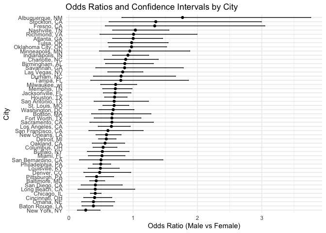

p8105_hw6_mc5698
================
2024-11-25

\#Problem 1

``` r
#Read dataset
set.seed(1)

weather_df = 
  rnoaa::meteo_pull_monitors(
    c("USW00094728"),
    var = c("PRCP", "TMIN", "TMAX"), 
    date_min = "2017-01-01",
    date_max = "2017-12-31") %>%
  mutate(
    name = recode(id, USW00094728 = "CentralPark_NY"),
    tmin = tmin / 10,
    tmax = tmax / 10) %>%
  select(name, id, everything())
```

``` r
#Define function
bootstrap_results <- map_df(1:5000, function(i) {
  sample_df <- weather_df %>% sample_frac(size = 1, replace = TRUE)
  lm_model <- lm(tmax ~ tmin, data = sample_df)
  
  glance_metrics <- glance(lm_model)
  tidy_metrics <- tidy(lm_model)
  
  r_squared <- glance_metrics$r.squared
  log_beta <- log(tidy_metrics$estimate[1] * tidy_metrics$estimate[2])
  
  tibble(
    r_squared = r_squared,
    log_beta = log_beta)})
```

``` r
# Confidence Intervals
ci_r_squared <- quantile(bootstrap_results$r_squared, probs = c(0.025, 0.975))
ci_log_beta <- quantile(bootstrap_results$log_beta, probs = c(0.025, 0.975))

ci_r_squared
```

    ##      2.5%     97.5% 
    ## 0.8936684 0.9271060

``` r
ci_log_beta
```

    ##     2.5%    97.5% 
    ## 1.964949 2.058887

``` r
# Plot Results
bootstrap_results %>%
  pivot_longer(everything(), names_to = "metric", values_to = "value") %>%
  ggplot(aes(x = value)) +
  geom_histogram(bins = 30, fill = "blue", alpha = 0.7) +
  facet_wrap(~ metric, scales = "free", ncol = 1) +
  theme_minimal() +
  labs(title = "Bootstrap Distributions", x = "Value", y = "Count")
```

<!-- -->

\#Problem 2

``` r
# Load the data
homicide_data <- read_csv("data/homicide-data.csv")
```

``` r
# Data Cleaning
omit_cities <- c("Dallas, TX", "Phoenix, AZ", "Kansas City, MO", "Tulsa, AL")

filtered_data <- homicide_data %>%
  mutate(
    city_state = paste(city, state, sep = ", "),
    solved = if_else(str_detect(disposition, "Closed"), 1, 0),
    victim_age = as.numeric(victim_age)
  ) %>%
  filter(
    !city_state %in% omit_cities,
    victim_race %in% c("White", "Black")
  ) %>%
  drop_na(victim_age, victim_sex, victim_race, solved)
```

``` r
# Model for Baltimore
baltimore_data <- filtered_data %>%
  filter(city_state == "Baltimore, MD")

baltimore_model <- glm(solved ~ victim_age + victim_sex + victim_race, 
                       data = baltimore_data, family = binomial)

baltimore_results <- broom::tidy(baltimore_model, conf.int = TRUE) %>%
  filter(term == "victim_sexMale") %>%
  mutate(
    odds_ratio = exp(estimate),
    ci_lower = exp(conf.low),
    ci_upper = exp(conf.high)
  )

baltimore_results %>% 
  select(odds_ratio, ci_lower, ci_upper)
```

    ## # A tibble: 1 × 3
    ##   odds_ratio ci_lower ci_upper
    ##        <dbl>    <dbl>    <dbl>
    ## 1      0.355    0.267    0.468

``` r
#For All Cities
city_results <- filtered_data %>%
  group_by(city_state) %>%
  nest() %>%
  mutate(
    model = map(data, ~ glm(solved ~ victim_age + victim_sex + victim_race, 
                            data = ., family = binomial)),
    tidy_model = purrr::map(model, ~ tryCatch(tidy(.x, conf.int = TRUE), 
                                       error = function(e) NULL))) %>%
  unnest(tidy_model) %>%
  filter(term == "victim_sexMale") %>%
  mutate(
    odds_ratio = exp(estimate),
    ci_lower = exp(conf.low),
    ci_upper = exp(conf.high)
  ) %>%
  select(city_state, odds_ratio, ci_lower, ci_upper)
city_results 
```

    ## # A tibble: 47 × 4
    ## # Groups:   city_state [47]
    ##    city_state      odds_ratio ci_lower ci_upper
    ##    <chr>                <dbl>    <dbl>    <dbl>
    ##  1 Albuquerque, NM      0.430   0.132     1.16 
    ##  2 Atlanta, GA          0.512   0.323     0.789
    ##  3 Baltimore, MD        0.355   0.267     0.468
    ##  4 Baton Rouge, LA      0.319   0.160     0.596
    ##  5 Birmingham, AL       0.704   0.444     1.09 
    ##  6 Boston, MA           0.674   0.353     1.28 
    ##  7 Buffalo, NY          0.438   0.239     0.793
    ##  8 Charlotte, NC        0.301   0.143     0.572
    ##  9 Chicago, IL          0.391   0.321     0.476
    ## 10 Cincinnati, OH       0.206   0.0977    0.390
    ## # ℹ 37 more rows

``` r
# plot
city_results %>%
  arrange(odds_ratio) %>%
  ggplot(aes(x = reorder(city_state, odds_ratio), y = odds_ratio)) +
  geom_point() +
  geom_errorbar(aes(ymin = ci_lower, ymax = ci_upper), width = 0.2) +
  coord_flip() +
  labs(
    title = "Estimated Odds Ratios and Confidence Intervals for Solving Homicides by City",
    x = "City",
    y = "Odds Ratio (Male vs Female)"
  ) +
  theme_minimal()
```

<!-- -->
The graph shows the estimated odds ratios and 95% confidence intervals
for solving homicides comparing male to female victims across various
U.S. cities. In most cities, such as Baltimore and Atlanta, the ORs are
below 1, suggesting that homicides involving male victims are less
likely to be solved compared to female victims. Moreover, some cities
like Fresno and Birmingham, have confidence intervals that cross 1,
implying that the difference in solving rates between male and female
victims may not be statistically significant in those locations.

\#Problem 3

``` r
#Read data
birthweight_data <- read_csv("data/birthweight.csv")
```

    ## Rows: 4342 Columns: 20
    ## ── Column specification ────────────────────────────────────────────────────────
    ## Delimiter: ","
    ## dbl (20): babysex, bhead, blength, bwt, delwt, fincome, frace, gaweeks, malf...
    ## 
    ## ℹ Use `spec()` to retrieve the full column specification for this data.
    ## ℹ Specify the column types or set `show_col_types = FALSE` to quiet this message.

``` r
# Data Cleaning
omit_cols <- c("bhead", "blength", "delwt", "fincome", "gaweeks", "mheight", 
               "momage", "parity", "ppbmi", "smoken", "wtgain", "bwt")

birthweight_clean <- birthweight_data %>%
  select(all_of(omit_cols)) %>%
  drop_na()
```

``` r
# Split the Data
set.seed(123)
birthweight_split <- initial_split(birthweight_clean, prop = 0.7)
birthweight_train <- training(birthweight_split)
birthweight_test <- testing(birthweight_split)

# Fit a linear model 
linear_model <- lm(bwt ~ ., data = birthweight_train)

# Use broom to tidy the model output
linear_model_summary <- tidy(linear_model)
```

``` r
# Predict dataset
birthweight_test <- birthweight_test %>%
  mutate(predicted_bwt = predict(linear_model, newdata = birthweight_test))

# R-squared and RMSE
rmse <- birthweight_test %>%
  summarise(rmse = sqrt(mean((bwt - predicted_bwt)^2))) %>%
  pull(rmse)

rsq <- birthweight_test %>%
  summarise(
    ss_total = sum((bwt - mean(bwt))^2),
    ss_residual = sum((bwt - predicted_bwt)^2),
    rsq = 1 - (ss_residual / ss_total)
  ) %>%
  pull(rsq)

model_metrics <- tibble(
  Metric = c("RMSE", "R-squared"),
  Value = c(rmse, rsq)
)
model_metrics
```

    ## # A tibble: 2 × 2
    ##   Metric      Value
    ##   <chr>       <dbl>
    ## 1 RMSE      281.   
    ## 2 R-squared   0.711

``` r
#Cross-Validation
set.seed(123)
cv_folds <- vfold_cv(birthweight_train, v = 10)

cv_results <- cv_folds %>%
  mutate(
    model = map(splits, ~ lm(bwt ~ ., data = analysis(.x))),
    metrics = map2(
      splits, model, 
      ~ {
        test_data <- assessment(.x)
        predictions <- predict(.y, newdata = test_data)
        tibble(
          rmse = sqrt(mean((test_data$bwt - predictions)^2)),
          rsq = 1 - sum((test_data$bwt - predictions)^2) / sum((test_data$bwt - mean(test_data$bwt))^2) )
      }
    )
  ) %>%
  unnest(metrics)

cv_summary <- cv_results %>%
  summarise(
    avg_rmse = mean(rmse),
    avg_rsq = mean(rsq)
  )
cv_summary
```

    ## # A tibble: 1 × 2
    ##   avg_rmse avg_rsq
    ##      <dbl>   <dbl>
    ## 1     279.   0.692

``` r
# Bootstrapping
set.seed(123)
bootstrap_results <- boot(
  data = birthweight_train,
  statistic = function(data, indices) {
    sample_data <- data[indices, ]
    model <- lm(bwt ~ ., data = sample_data)
    coef(model)
  },
  R = 1000
)

bootstrap_summary <- boot.ci(bootstrap_results, type = "perc")
bootstrap_summary
```

    ## BOOTSTRAP CONFIDENCE INTERVAL CALCULATIONS
    ## Based on 1000 bootstrap replicates
    ## 
    ## CALL : 
    ## boot.ci(boot.out = bootstrap_results, type = "perc")
    ## 
    ## Intervals : 
    ## Level     Percentile     
    ## 95%   (-7840, -5096 )  
    ## Calculations and Intervals on Original Scale
